# Smart Home Gesture Recognition via IMU Sensor

<p align="center">
  
  
  
  
  
  
</p>

> **Graduation Thesis** — A real-time hand gesture recognition system using a 6-axis IMU sensor (ESP32 + MPU6050). Gestures are classified by machine learning / deep learning models and mapped to smart home device commands delivered through a live web interface.

---

## Table of Contents

- [Overview](#overview)
- [System Architecture](#system-architecture)
- [Gesture Set](#gesture-set)
- [Dataset](#dataset)
- [Project Structure](#project-structure)
- [Requirements](#requirements)
- [Installation](#installation)
- [Workflow](#workflow)
  - [1. Data Collection](#1-data-collection)
  - [2. Model Training (50 Hz)](#2-model-training-50-hz)
  - [3. Model Training (100 Hz Pipeline)](#3-model-training-100-hz-pipeline)
  - [4. Smart Home Demo](#4-smart-home-demo)
- [Model Performance](#model-performance)
- [Large-File Handling (Git LFS)](#large-file-handling-git-lfs)
- [Detailed Documentation](#detailed-documentation)

---

## Overview

This project explores wearable gesture-based control for smart home environments. An ESP32 microcontroller samples a MPU6050 IMU at **100 Hz**, streaming raw 6-DOF inertial data (`ax, ay, az, gx, gy, gz`) over Serial USB. A Python pipeline:

1. **Collects** labelled trial data via a Streamlit GUI.
2. **Preprocesses** and resamples signals to a clean 50 Hz dataset.
3. **Trains** four classifier architectures — Random Forest, CNN, LSTM, and Transformer — and generates evaluation assets (confusion matrices, t-SNE plots, per-class F1 scores).
4. **Deploys** a FastAPI + WebSocket backend that reads the sensor in real time, classifies each 4-second window, and updates a simulated smart home dashboard in the browser with optional text-to-speech feedback.

---

## System Architecture

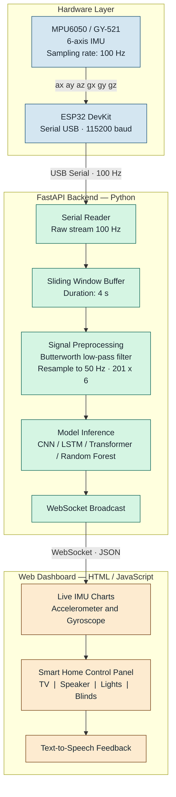

### Signal Processing Pipeline

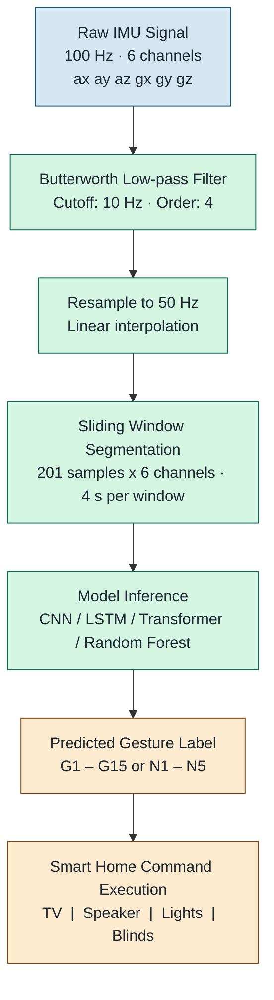

---

## Gesture Set

| Label | Command | Label | Command |
|:-----:|---------|:-----:|---------|
| **G1** | System wake-up | **G9** | Speaker volume down |
| **G2** | Next device / task | **G10** | Turn light on |
| **G3** | Favourite TV channel | **G11** | Turn light off |
| **G4** | TV power toggle | **G12** | Close blinds |
| **G5** | Channel up | **G13** | Open blinds |
| **G6** | Channel down | **G14** | System shutdown |
| **G7** | Voice search | **G15** | Emergency reset |
| **G8** | Speaker volume up | **N1–N5** | Noise / non-gesture |

Full label definitions: [`data_collection/labels.json`](data_collection/labels.json)

---

## Dataset

### Collection Statistics

| Split | Subjects | Trials | IMU Samples |
|-------|:--------:|-------:|------------:|
| **Train** | S01–S11 | 7,882 | ~1,484,000 |
| **Validation** | S12–S13 | 1,432 | ~288,000 |
| **Test** | S14–S15 | 1,330 | ~267,000 |
| **Total** | 15 | **10,644** | **~2,039,000** |

### Subject Breakdown

| Subject | Split | Trials | IMU Samples |
|---------|-------|-------:|------------:|
| S01 | Train | 932 | 187,332 |
| S02 | Train | 680 | 136,680 |
| S03 | Train | 680 | 136,680 |
| S04 | Train | 600 | 120,600 |
| S05 | Train | 780 | 156,780 |
| S06 | Train | 730 | 146,730 |
| S07 | Train | 700 | 140,700 |
| S08 | Train | 800 | 160,800 |
| S09 | Train | 600 | 120,600 |
| S10 | Train | 600 | 120,600 |
| S11 | Train | 780 | 156,780 |
| S12 | Validation | 832 | 167,232 |
| S13 | Validation | 600 | 120,600 |
| S14 | Test | 600 | 120,600 |
| S15 | Test | 730 | 146,730 |

### Gesture Distribution

| Label | Name | Count | | Label | Name | Count |
|:-----:|------|------:|-|:-----:|------|------:|
| G1 | star_first | 510 | | G11 | light_off | 540 |
| G2 | select_wrist_rotate | 530 | | G12 | curtain_close | 540 |
| G3 | tv_favorite_chanel | 550 | | G13 | curtain_open | 540 |
| G4 | tv_swtich_source | 590 | | G14 | stop_palm | 520 |
| G5 | tv_channel_up | 570 | | G15 | emergency_reset | 520 |
| G6 | tv_channel_down | 550 | | N1 | noise_walking | 500 |
| G7 | tv_voice_search | 550 | | N2 | noise_watch | 500 |
| G8 | speaker_volume_up | 550 | | N3 | noise_typing | 500 |
| G9 | speaker_volume_down | 550 | | N4 | noise_drinking | 500 |
| G10 | light_on | 534 | | N5 | noise_scratch | 500 |

<p align="center">
  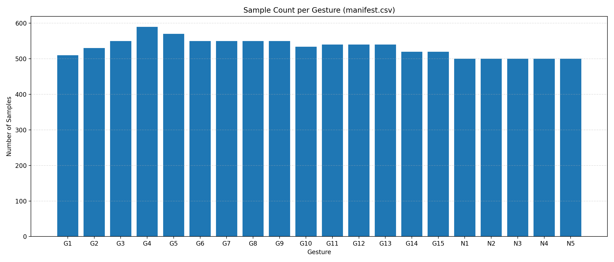
  <br><em>Figure 1 — Gesture class sample distribution across all subjects</em>
</p>

<p align="center">
  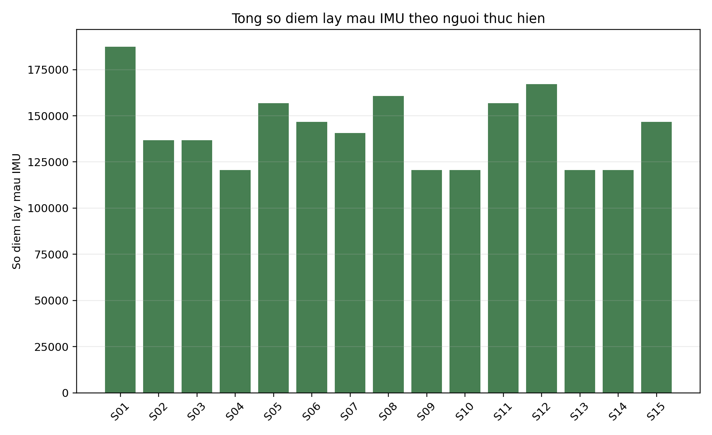
  <br><em>Figure 2 — IMU sample count per subject</em>
</p>

<p align="center">
  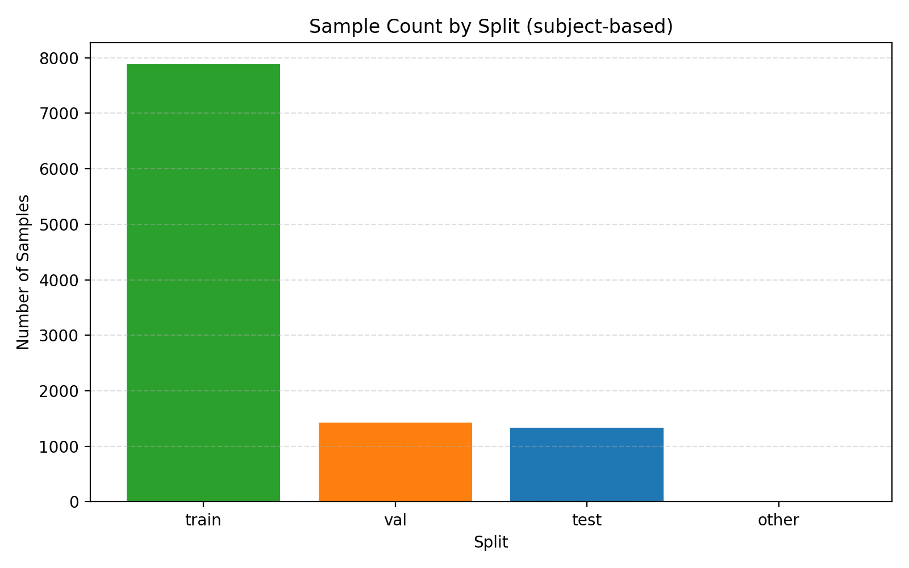
  <br><em>Figure 3 — Train / Validation / Test split</em>
</p>

---

## Project Structure

```
DOAN2/
├── data_collection/          # Data acquisition — ESP32 firmware, Streamlit GUI, raw CSV dataset
│   ├── firmware/             #   Arduino sketch for ESP32 + MPU6050
│   ├── streamlit_app.py      #   GUI for recording labelled trials
│   ├── data/
│   │   ├── raw/              #   Per-subject per-label CSV files (100 Hz)
│   │   └── processed_50hz/   #   Resampled dataset + manifest
│   └── labels.json           #   Gesture label definitions
│
├── training_50hz_clean/      # Primary training pipeline (50 Hz clean dataset)
│   ├── scripts/              #   PowerShell train / report scripts
│   ├── models/               #   Saved checkpoints (.pt, .joblib)
│   └── results/
│       ├── plots/            #   Accuracy/F1 comparison, training curves, t-SNE
│       ├── confusion/        #   Per-model confusion matrices
│       ├── tsne/             #   t-SNE feature visualisations
│       └── tables/           #   CSV comparison reports
│
├── train_model/              # Alternative 100 Hz training pipeline
│   ├── configs/              #   JSON experiment configs
│   ├── src/                  #   Training source code
│   └── outputs/              #   Model outputs and reports
│
├── training/                 # Legacy training artefacts (reference only)
│
├── demo/                     # Smart home demo
│   ├── backend/              #   FastAPI app, Serial reader, predictor
│   ├── static/               #   Web dashboard (HTML / CSS / JS)
│   ├── run_demo.ps1          #   One-click launcher
│   └── predict_cli.py        #   Offline prediction CLI
│
└── tools/                    # Helper scripts for report generation
```

---

## Requirements

| Dependency | Version |
|---|---|
| Python | 3.10+ |
| OS | Windows 10 / 11 (PowerShell 5.1+) |
| Hardware | ESP32 DevKit + MPU6050 (GY-521) |
| Git LFS | Required for large binary assets |

Install Git LFS once:

```powershell
git lfs install
```

---

## Installation

### 1. Clone the repository

```powershell
git clone https://github.com/phamthihongngoc/DOAN.git
cd DOAN
git lfs pull          # download datasets, checkpoints, and model files
```

### 2. Create and activate a virtual environment

```powershell
python -m venv .venv
.\.venv\Scripts\Activate.ps1
python -m pip install --upgrade pip
```

### 3. Install dependencies per module

```powershell
# Data collection
python -m pip install -r data_collection\requirements.txt

# Model training (50 Hz)
python -m pip install -r training_50hz_clean\requirements.txt

# Demo backend
python -m pip install -r demo\requirements.txt
```

---

## Workflow

### 1. Data Collection

Flash the firmware and record labelled gesture trials.

**Flash firmware:**

Upload `data_collection\firmware\esp32_mpu6050_logger\esp32_mpu6050_logger.ino` to your ESP32 using the Arduino IDE (board: ESP32 Dev Module, baud: 115200).

**Launch the Streamlit recording GUI:**

```powershell
cd data_collection
..\.venv\Scripts\python.exe -m streamlit run streamlit_app.py
# or use the convenience script:
.\run_streamlit.ps1
```

**Recording steps:**

1. Connect the ESP32 via USB and select the correct COM port.
2. Enter a **Subject ID** (e.g., `S01`).
3. Click a gesture button (`G1`–`G15`) or noise button (`N1`–`N5`).
4. Hold the gesture for 3–5 seconds.
5. Release — the trial is saved automatically to:
   `data_collection\data\raw\<Subject>\<Label>\<timestamp>.csv`

**CSV schema:**

```
time, ax_g, ay_g, az_g, gx_dps, gy_dps, gz_dps, label
```

---

### 2. Model Training (50 Hz)

Working directory: `training_50hz_clean/`

**Train all models (100 epochs each):**

```powershell
training_50hz_clean\scripts\train_cnn_100epoch.ps1
training_50hz_clean\scripts\train_lstm_100epoch.ps1
training_50hz_clean\scripts\train_transformer_100epoch.ps1
training_50hz_clean\scripts\train_random_forest.ps1
```

**Generate report assets:**

```powershell
training_50hz_clean\scripts\generate_report_assets.ps1
training_50hz_clean\scripts\generate_per_activity_f1.ps1
training_50hz_clean\scripts\plot_training_history.ps1
```

**Key outputs:**

| Path | Description |
|---|---|
| `results\tables\model_comparison_report_vi.csv` | Accuracy / F1 comparison table |
| `results\plots\model_accuracy_f1_comparison.png` | Bar chart comparison |
| `results\confusion\` | Per-model confusion matrices |
| `results\tsne\` | t-SNE feature visualisations |

---

### 3. Model Training (100 Hz Pipeline)

Working directory: `train_model/`

```powershell
cd train_model
..\.venv\Scripts\python.exe -m src.run_all --config configs\default.json
# or:
.\scripts\run_all.ps1
```

Trains all four model architectures on the raw 100 Hz dataset and saves a consolidated report under `train_model\outputs\`.

---

### 4. Smart Home Demo

Working directory: `demo/`

**One-click launch (backend + browser):**

```powershell
demo\run_demo.ps1
```

**Manual launch:**

```powershell
.\.venv\Scripts\python.exe -m uvicorn demo.backend.app:app --host 0.0.0.0 --port 8000
```

Open [http://127.0.0.1:8000/](http://127.0.0.1:8000/) in your browser.

**Demo features:**

- Streams live accelerometer and gyroscope charts from the ESP32.
- Buffers a 4-second sliding window and resamples to 201 points at 50 Hz.
- Runs inference with the selected trained model.
- Updates the simulated smart home panel (TV, speaker, lights, blinds) in real time.
- Announces accepted commands via browser text-to-speech.

---

## Model Performance

> Evaluated on the held-out test set (**S14–S15**, 1 330 windows), 20 classes (G1–G15 + N1–N5), 50 Hz clean dataset.

### Overall Comparison

| Model | Params | GFLOPs | Inference (ms) | Accuracy | Macro F1 |
|-------|-------:|-------:|:--------------:|:--------:|:--------:|
| **Transformer** | 284,948 | 0.054 | 4.09 | **99.85%** | **99.83%** |
| **LSTM** | 220,820 | 0.082 | 1.19 | 99.70% | 99.67% |
| **CNN** | 213,460 | 0.038 | 0.47 | 98.95% | 98.93% |
| Random Forest | — | — | **0.10** | 100.00% | 100.00% |
| XGBoost | — | — | 0.10 | 100.00% | 100.00% |
| SVM | — | — | 1.34 | 94.36% | 94.27% |
| Gradient Boosting | — | — | 0.06 | 93.83% | 93.83% |

<p align="center">
  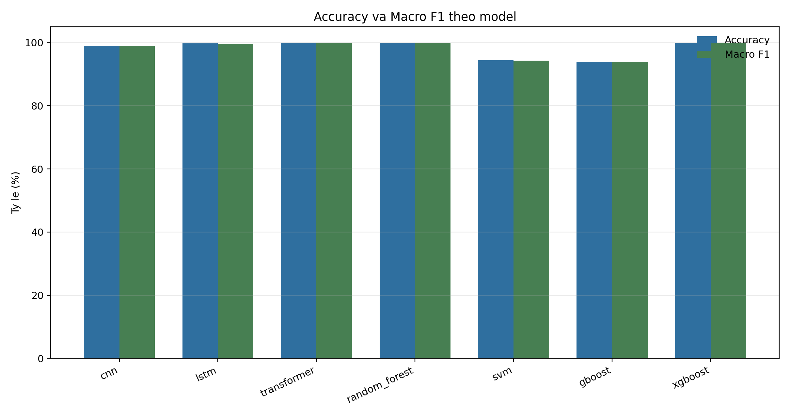
  <br><em>Figure 4 — Test accuracy and macro-F1 comparison across all models</em>
</p>

<p align="center">
  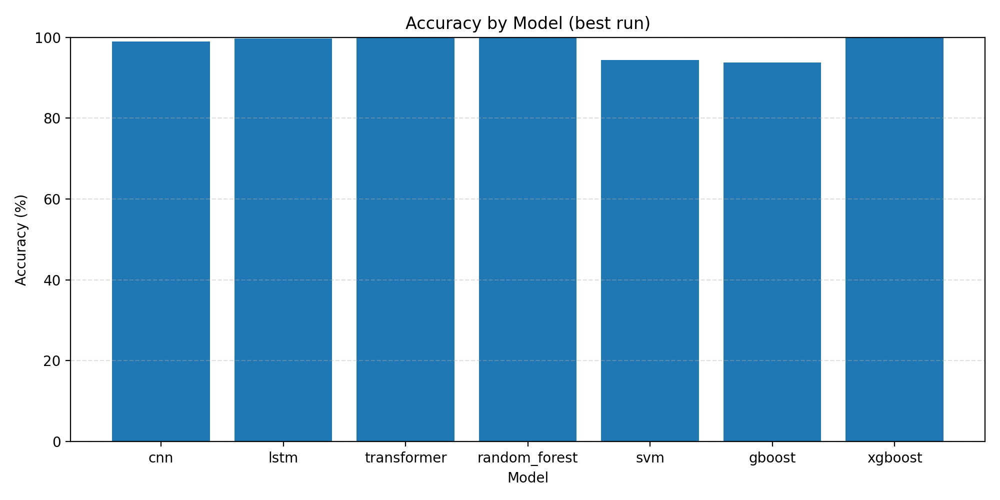
  <br><em>Figure 5 — Test accuracy per model</em>
</p>

<p align="center">
  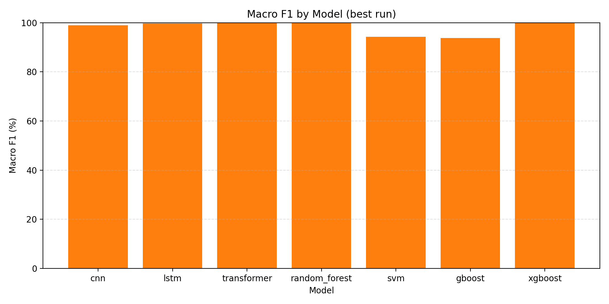
  <br><em>Figure 6 — Macro F1 per model</em>
</p>

---

### CNN Training Curve

<p align="center">
  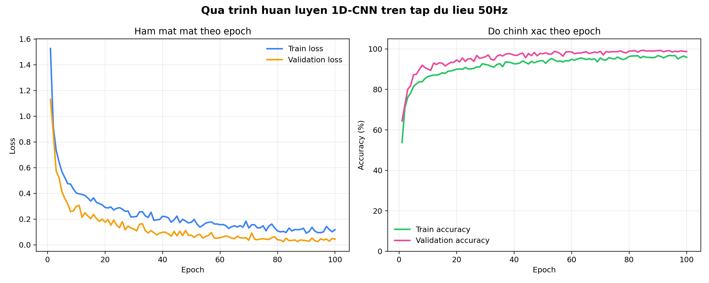
  <br><em>Figure 7 — CNN training loss and validation accuracy over 100 epochs</em>
</p>

---

### Confusion Matrices

<p align="center">
  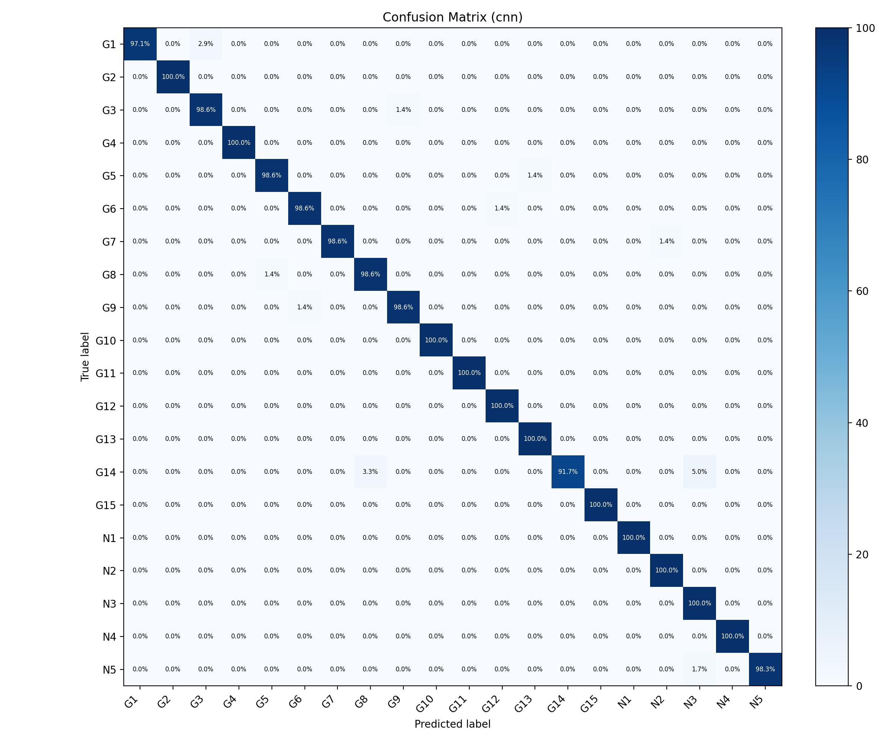
  <br><em>Figure 8 — CNN confusion matrix (test set)</em>
</p>

<p align="center">
  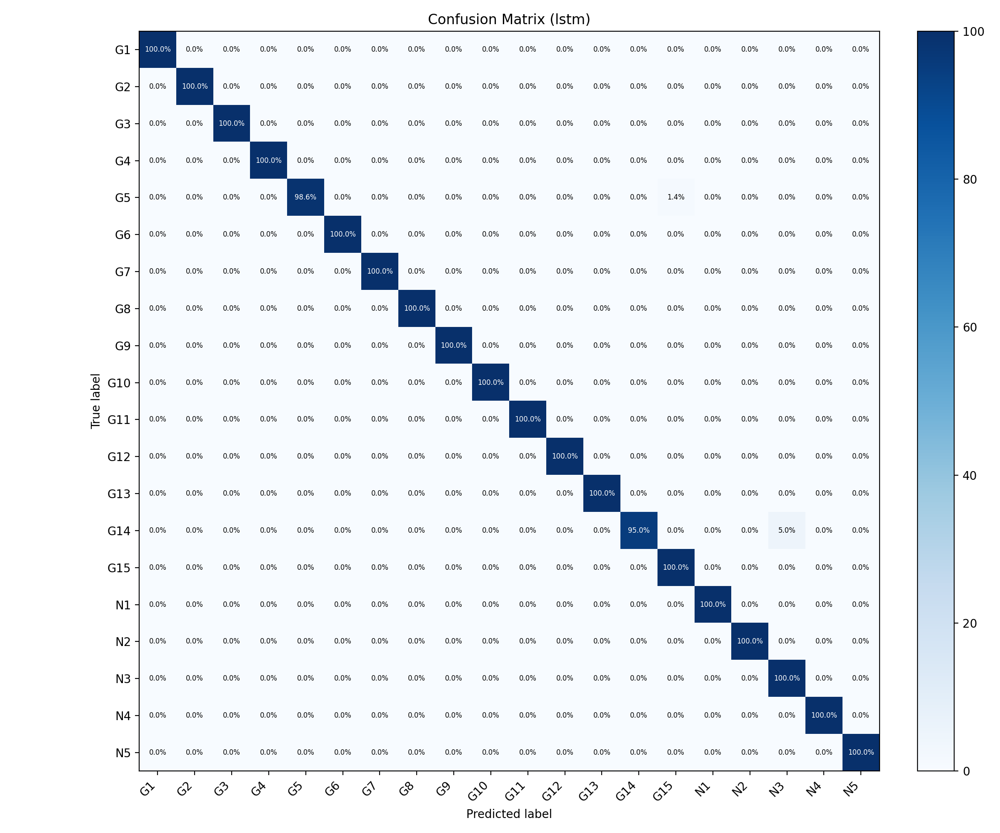
  <br><em>Figure 9 — LSTM confusion matrix (test set)</em>
</p>

<p align="center">
  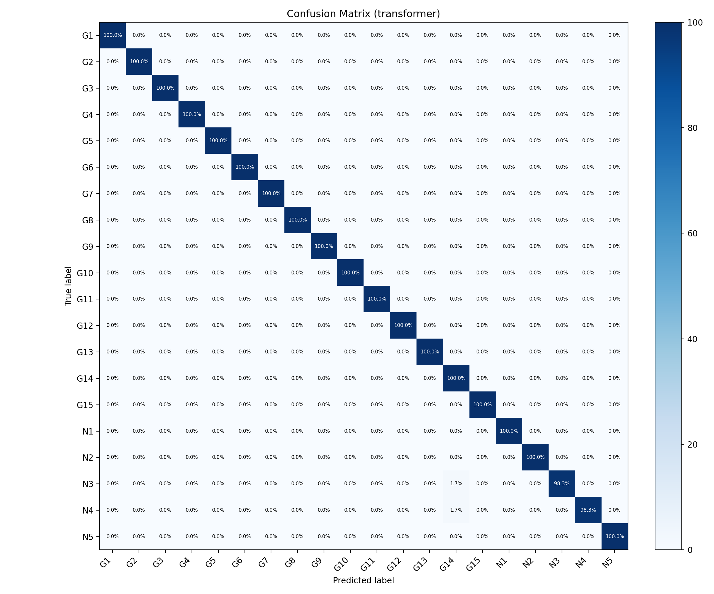
  <br><em>Figure 10 — Transformer confusion matrix (test set)</em>
</p>

---

### t-SNE Feature Visualisation

<p align="center">
  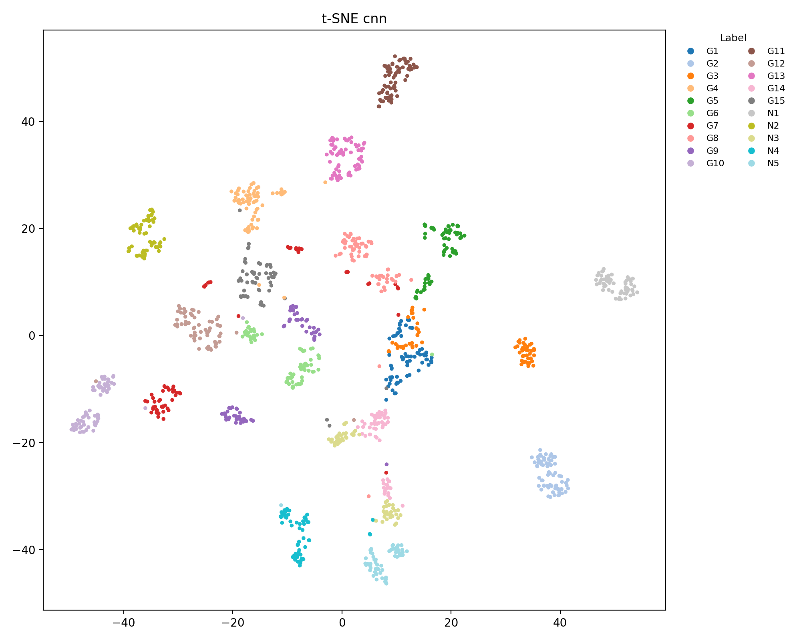
  <br><em>Figure 11 — t-SNE of CNN feature embeddings (test set)</em>
</p>

<p align="center">
  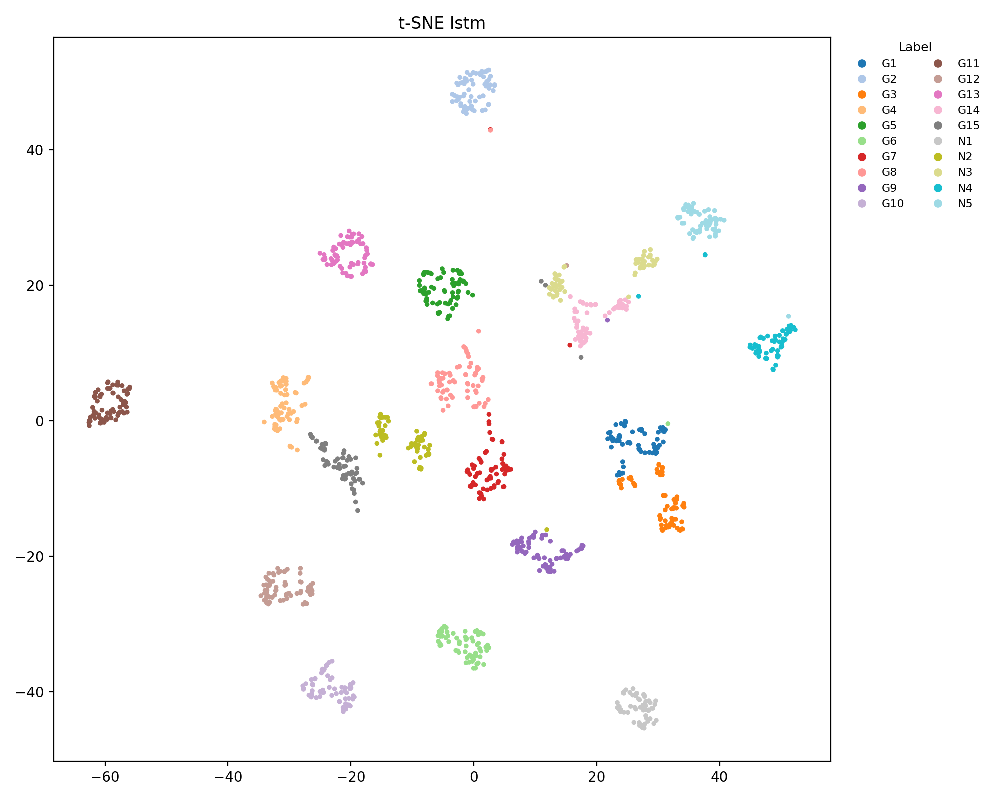
  <br><em>Figure 12 — t-SNE of LSTM feature embeddings (test set)</em>
</p>

<p align="center">
  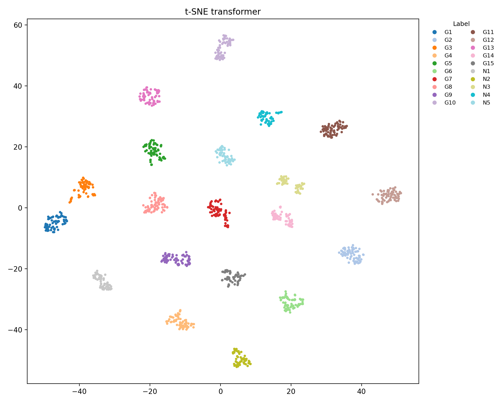
  <br><em>Figure 13 — t-SNE of Transformer feature embeddings (test set)</em>
</p>

---

### Per-Gesture F1 Score

<p align="center">
  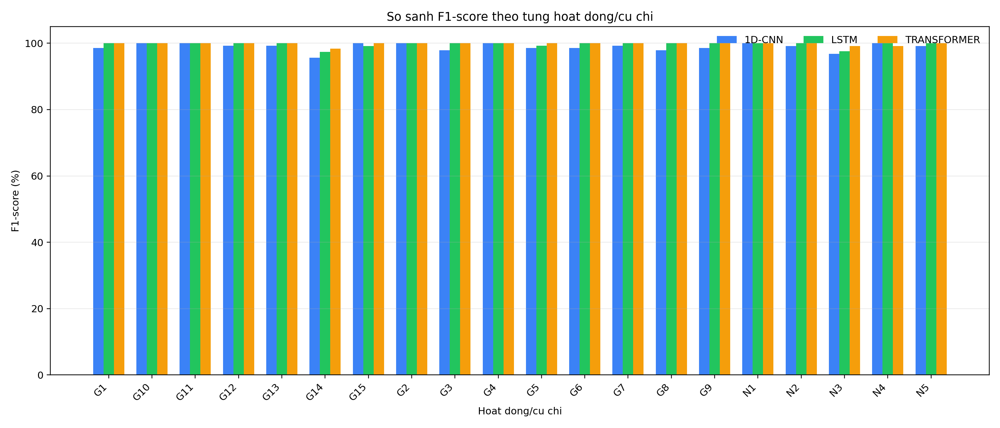
  <br><em>Figure 14 — Per-gesture F1 score by model</em>
</p>

<p align="center">
  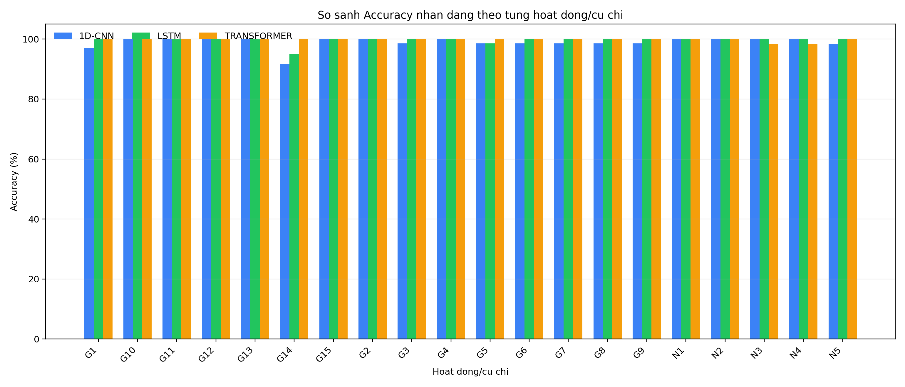
  <br><em>Figure 15 — Per-gesture accuracy by model</em>
</p>

#### Transformer — Per-Class Precision / Recall / F1

| Label | Class | Precision | Recall | F1 |
|:-----:|-------|:---------:|:------:|:--:|
| G1 | star_first | 100.0% | 100.0% | **100.0%** |
| G2 | select_wrist_rotate | 100.0% | 100.0% | **100.0%** |
| G3 | tv_favorite_chanel | 100.0% | 100.0% | **100.0%** |
| G4 | tv_swtich_source | 100.0% | 100.0% | **100.0%** |
| G5 | tv_channel_up | 100.0% | 100.0% | **100.0%** |
| G6 | tv_channel_down | 100.0% | 100.0% | **100.0%** |
| G7 | tv_voice_search | 100.0% | 100.0% | **100.0%** |
| G8 | speaker_volume_up | 100.0% | 100.0% | **100.0%** |
| G9 | speaker_volume_down | 100.0% | 100.0% | **100.0%** |
| G10 | light_on | 100.0% | 100.0% | **100.0%** |
| G11 | light_off | 100.0% | 100.0% | **100.0%** |
| G12 | curtain_close | 100.0% | 100.0% | **100.0%** |
| G13 | curtain_open | 100.0% | 100.0% | **100.0%** |
| G14 | stop_palm | 96.8% | 100.0% | 98.4% |
| G15 | emergency_reset | 100.0% | 100.0% | **100.0%** |
| N1 | noise_walking | 100.0% | 100.0% | **100.0%** |
| N2 | noise_watch | 100.0% | 100.0% | **100.0%** |
| N3 | noise_typing | 100.0% | 98.3% | 99.2% |
| N4 | noise_drinking | 100.0% | 98.3% | 99.2% |
| N5 | noise_scratch | 100.0% | 100.0% | **100.0%** |

---

## Large-File Handling (Git LFS)

The following file types are tracked by [Git LFS](https://git-lfs.com/):

| Extension | Content |
|-----------|---------|
| `*.pt` | PyTorch model checkpoints |
| `*.joblib` | Scikit-learn model files |
| `*.npz` | NumPy compressed arrays (dataset splits) |
| `*.zip` | Compressed archives |
| `*.xlsx` | Excel report exports |

After a fresh clone, run `git lfs pull` to download all tracked assets.

Virtual-environment folders, `__pycache__`, log files, and editor settings are excluded via `.gitignore`.

---

## Detailed Documentation

| Module | README |
|---|---|
| Data collection | [`data_collection/README.md`](data_collection/README.md) |
| Training (50 Hz) | [`training_50hz_clean/README.md`](training_50hz_clean/README.md) |
| Training (100 Hz) | [`train_model/README.md`](train_model/README.md) |
| Demo backend & web | [`demo/README.md`](demo/README.md) |

---

<p align="center">
  Made with Python · FastAPI · PyTorch · Scikit-learn · ESP32
</p>
